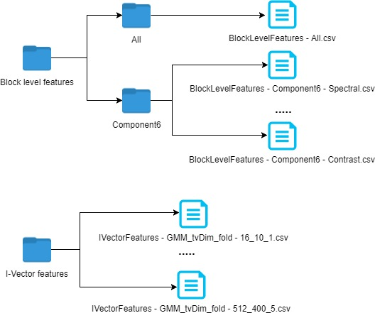
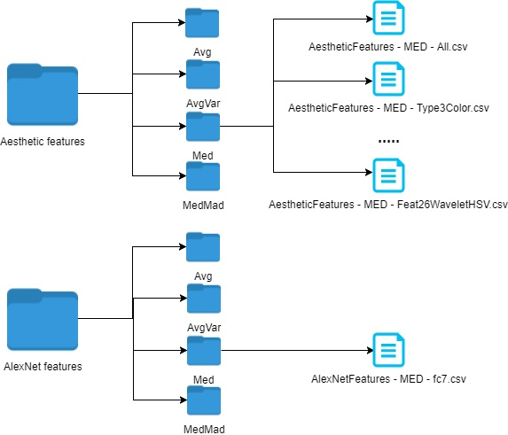

# Datasets

The <b>Audio descriptors</b> folder contains two sub-folders: <a href="http://www.cp.jku.at/people/schedl/Research/Publications/pdf/seyerlehner_smc_2010.pdf" target="_blank">block-level features (BLF)</a> and <a href="http://www.cp.jku.at/people/schedl/Research/Publications/pdf/eghbal-zadeh_ismir_2015.pdf" target="_blank">i-vector features</a>. The BLF contains 6 descriptors computed from the audio spectrum, among others, spectral patterns (modeling the timbral content), fluctuation patterns (modeling the strength of recurring beats over various frequency bands), and correlation patterns (modeling the correlation between frequency bands to uncover harmonic characteristics). The i-vector features describe timbral characteristics of audio by modeling distributions over <a href="http://musicweb.ucsd.edu/~sdubnov/CATbox/Reader/logan00mel.pdf" target="_blank">Mel frequency cepstral coefficients (MFCCs)</a>.

While the BLF data includes the raw features of the 6 subcomponents and similarities computed thereon, the i-vector features include different parameters for the Gaussian mixture model (GMM) and total variability dimension (tvDim). The BLF folder has two subfolders: <i>All</i> and <i>Component6</i>; the former contains the similarities computed using all 6 subcomponents, the latter contains the raw feature vectors of the subcomponents in separate CSV files.

The <b>Visual descriptors</b> folder contains two subfolders: <a href="https://peerj.com/articles/1390/" target="_blank">Aesthetic features</a> and <a href="https://papers.nips.cc/paper/4824-imagenet-classification-with-deep-convolutional-neural-networks.pdf" target="_blank">AlexNet features</a>, each of them including different aggregation schemes for the two types of visual features. The <i>Aesthetic features</i>folder includes 4 subfolders, corresponding to the 4 aggregation schemes: <i>Avg</i> containing the average aggregation scheme, <i>AvgVar</i> the average and variance aggregation scheme, <i>Med</i> containing the median scheme and finally <i>MedMad</i> the median and median absolute deviation aggregation. Each of these folders contain 30 CSV files, representing the different early fusion schemes applied to these features: individual components (i.e. <i>AestheticFeatures - MED - Feat26Convexity</i>, <i>AestheticFeatures - AVG - Feat26Edge</i>), early fusion based on the 3 main types (i.e. <i>AestheticFeatures - MEDMAD - Type3Color.csv</i>, <i>AestheticFeatures - AVG - Type3Texture.csv</i>) and finally a vector containing all the component concatenated (i.e. <i>AestheticFeatures - MED - All.csv</i>). The <i>AlexNet features</i> folder has a similar structure, containing the 4 subfolders, each of them corresponding to a different aggregation scheme: <i>Avg, AvgVar, Med</i> and <i>MedMad</i>. The structure of these archives is simpler than the case for the AVF features, considering that no early fusion scheme is needed or applicable to the fc7 layer output. Therefore, only one file will be present in these folders, depending on the aggregation scheme (i.e. <i>AlexNetFeatures - MED - fc7</i>).

